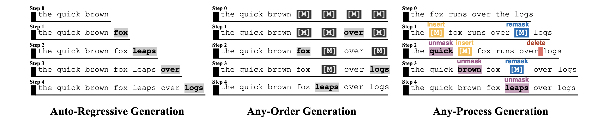

# 🔋 On Powerful Ways to Generate: Autoregression, Diffusion, and Beyond

This is the official implementation for paper "On Powerful Ways to Generate: Autoregression, Diffusion, and Beyond". 

This paper formally studies generation processes, including auto-regressive next-token prediction and masked diffusion, that abstract beyond architectural specifics. At this level of abstraction, we quantify their benefits and limitations through measurable criteria such as computational hardness and learnability. In particular, we demonstrate that allowing generation to proceed beyond autoregression and current masked diffusion, with capabilities to rewrite and length-variable edit, can bring significant theoretical and empirical advantages, with important implications for frontier LLMs that aspire to tackle increasingly hard problems and work universally across domains beyond natural language, such as coding and science.

Materials: 
[Paper](https://arxiv.org/pdf/2510.06190)

<p align="center">
    
</p>


## Installation

- Install other required packages via

```bash
pip install -r requirements.txt
```

- Install flash-attention

```bash
pip install flash-attn --no-build-isolation
```


## Datasets

### Sudoku

```bash
cd dataset/sudoku
python sudoku_generator.py sudoku-100.npy
```

This generates `sudoku-100.pkl.gz` containing APMDM training samples and `vocab_cache.pkl` containing the token vocabulary. You can process multiple files at once: `python sudoku_generator.py sudoku-100.npy sudoku-test.npy`. To visualize the generation process, run `python serve.py` and open http://localhost:8001/apmdm in your browser.

### Parity

```bash
cd dataset/parity
python parity_generator.py
```

This generates `parity_train.pkl.gz` containing 7 APMDM training samples (expanded to 1000 with repetition) and `parity_vocab_cache.pkl` containing the token vocabulary (5 tokens: BOS, EOS, MASK, 0, 1).

### Graph Generation (Max Flow)

```bash
cd dataset/max_flow
python maxflow_solver.py \
  --num_instances 10000 \
  --min_nodes 10 --max_nodes 10 \
  --min_edges 50 --max_edges 50 \
  --output graph.pkl.gz
```

This generates `graph.pkl.gz` containing APMDM training samples for max-flow problems and `vocab_cache.pkl` containing the token vocabulary. Customize graph parameters: `--num_instances` (number of graphs), `--min_nodes/max_nodes` (node count range), `--min_edges/max_edges` (edge count range), `--min_flow/max_flow` (flow guarantee range).

<!-- 
Create a folder `/data` and prepare datasets by running the following code:

For SAT and QBF

```bash
python dataset_sat.py \
    --num_samples=102000 \
    --train_size=5000 \
    --data_dir=data/${dataset} \
    --min_vars=5 \
    --max_vars=5
```

This script creates a total of `--num_samples` instances that include, by default, 1,000 validation samples and 1,000 test samples (which can be adjusted in the `process_dataset` function). The remaining examples form the training set; note that the training set is split into multiple files, each containing `--train_size` training instances, for large-scale experiments where one file could be very large. 

The `--min_vars` and `--max_vars` aruguments set the minimum and maximum number of variables per instance; if these values are equal, as in our experiments, all instances will have the same number of variables, but if they differ, the dataset will include a mix of instances with varying numbers of variables. 

For Einstein's puzzle

```bash
python einstein_generator.py \
    --num_samples 100000 \
    --data_dir data/${dataset} \
    --size 5 \
    --minimal_conditions \
    --save \

python einstein_solver.py \
    --data_dir data/${dataset} \
    --train_size 5000 \
```

For Einstein's Puzzle, first run `einstein_generator.py` to create a dataset of puzzle instances (with clues and solutions but no reasoning steps). Then, run `einstein_solver.py` to process the generated puzzles, which solves these puzzles and generate the reasoning steps (with special tokens for training the model).  -->


### Training and Evaluation

For SAT and QBF:

```bash
python train.py \
    config/config_3sat.py \
    --dataset=$dataset \
    --data_dir=data \
    --device=cuda \
    --format=pencil \
```

For Einstein's puzzle

```bash
python train_puzzle.py \
    config/config_puzzle.py \
    --dataset=$dataset \
    --data_dir=data \
    --device=cuda \
    --format=pencil
```

## Citation

If you find our codes useful, please consider citing our work

```bibtex
@article{yang2025powerful,
  title={On Powerful Ways to Generate: Autoregression, Diffusion, and Beyond},
  author={Yang, Chenxiao and Zhou, Cai and Wipf, David and Li, Zhiyuan},
  journal={arXiv preprint arXiv:2510.06190},
  year={2025}
}
```

## Acknowledgement

We thank [nanoGPT](https://github.com/karpathy/nanoGPT) and [Puzzle-Generator-and-Solver](https://github.com/quint-t/Puzzle-Generator-and-Solver) for providing useful implementations.